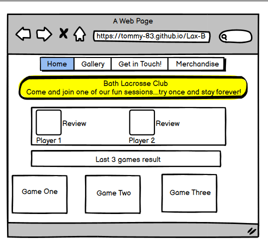
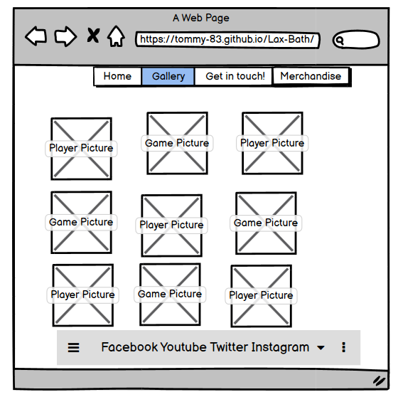

# Welcome to Bath Lacrosse Page
## Website
* This is a fully responsive website of Bath Lacrosse Club, its designed in order to showcase the clubs offer and encourage people to join the team and follow teams results.
## Code Institute - Milestone Project 1
## By Tomasz Kosakowski

* [view Website Link](https://tommy-83.github.io/Lax-Bath/)
* [view repository on GitHub](https://chocolate-bird-xd77hvy2.ws-eu38.gitpod.io/)

## Website goal
* Make the sport of Lacrosse more known and more accessible to people. Showcase the games, results and possibility of joining the community of this sport.
* By building the database of possible future players we want to share the knowlege as well as times of games, training sessions as well as other developement possibilitues.
* increas of the players numbers as well as people who would love to help to develope the sport further in the area.

## (UX) user Experiance
* Bu accessing the website users will be able to find out about past games, learn about the experiance of playing lacrosse from other players. By joining the data base they will be able to find out the times of training sessions, future games as well as where to buy the equipement needed to play the sport.

## Users Goals:
* First Time Users - This website will be the window to the new sport,will be able to read reviews , find the relevant information about training session as well as links to recommended retailers.
* Returning Users - The group of people that is already in the sport, looking to plan the league games times, take part in players session as well as find all the best gear, in order to take their game further.

## Design
* The main colors of the website are Gold and Darkblue with a small addition of Darkgrey.
* This colors were used as they do work well together, making a ballanced pallet not taking the attention of visitor from the content.
* Font used is Roboto
* Images used and copyrights:
1. Lax-1 to Lax-15 are owned by Pixabay.com
2. Lax-15 is owned by Styves Exantus @ Pixabay.com
3. Gaz is owned by Pixabay.com
4. Sam is owned by Creation Hill @ Pixabay.com
5. Lax-helmet is owned by pictureback @ Pixabay.com

## Wireframes:
* The basic design of the website was made with the use of [balsamiq](https://balsamiq.com/wireframes/)
1. Front page:
 * 
2. Gallery:
 * 

## Features
* The website is responsive on all devices

## Frameworks, Libraries & Programs Used
1. Bootstrap 4.4.1
2. Font Awesome
3. GitHub
4. Git

## Languages Used
* HTML5
* CSS3

## Online Resources and problem solving
* Quora
* w3schools
* Getbootstrap

## Code Used
1. 

  <label for="usr">Name:</label>
  <input type="text" class="form-control" id="usr">

  <label for="pwd">Password:</label>
  <input type="password" class="form-control" id="pwd">

* Used to set up inputs, code sourced from w3schools.com

2. 

  <label for="comment">Comment:</label>
  <textarea class="form-control" rows="5" id="comment"></textarea>

* Used to create comment section in signup area, code sourced from w3schools.com

## Testing
* The website was tested on Google Chroma as well as Microsoft Edge. All links were responsive and loading well. On both browsers website responded well to changing screen sizes.
* The website was tested on Safari, both desktop as well as mobile version ( vertical and horizontal). In both cases page loaded successfully.

