# Welcome to Bath Lacrosse Page
## Website
* This is a fully responsive website of Bath Lacrosse Club, its designed in order to showcase the clubs offer and encourage people to join the team and follow teams results.
## Code Institute - Milestone Project 1
## By Tomasz Kosakowski

* [view Website Link](https://tommy-83.github.io/Lax-Bath/)
* [view Repository on GitHub](https://chocolate-bird-xd77hvy2.ws-eu38.gitpod.io/)

## Website goal
* Make the sport of Lacrosse more known and more accessible to people. Showcase the games, results and possibility of joining the community of this sport.
* By building the database of possible future players we want to share the knowlege as well as times of games, training sessions as well as other developement possibilitues.
* increas of the players numbers as well as people who would love to help to develope the sport further in the area.

## (UX) user Experiance
* Bu accessing the website users will be able to find out about past games, learn about the experiance of playing lacrosse from other players. By joining the data base they will be able to find out the times of training sessions, future games as well as where to buy the equipement needed to play the sport.

## Users Goals:
* First Time Users - This website will be the window to the new sport,will be able to read reviews , find the relevant information about training session as well as links to recommended retailers.
* Returning Users - The group of people that is already in the sport, looking to plan the league games times, take part in players session as well as find all the best gear, in order to take their game further.

## Design
* The main colors of the website are Gold and Darkblue with a small addition of Darkgrey.
* This colors were used as they do work well together, making a ballanced pallet not taking the attention of visitor from the content.
* Font used is Roboto
* Images used and copyrights:
1. Lax-1 to Lax-15 are owned by Pixabay.com
2. Lax-15 is owned by Styves Exantus @ Pixabay.com
3. Gaz is owned by Pixabay.com
4. Sam is owned by Creation Hill @ Pixabay.com
5. Lax-helmet is owned by pictureback @ Pixabay.com

## Wireframes:
* The basic design of the website was made with the use of [balsamiq](https://balsamiq.com/wireframes/)
1. Front page:
 * 
2. Gallery:
 * 
3. Sign Up:
 * 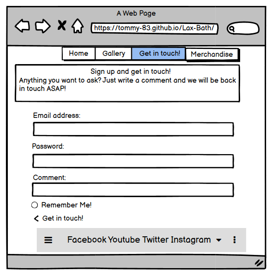
4. Merchandise:
 * 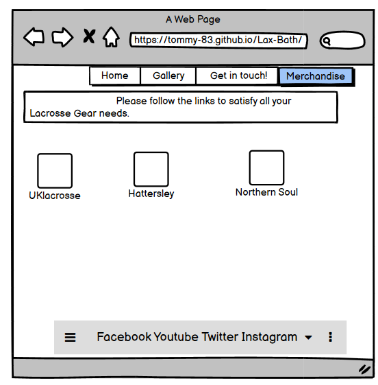

# Features
## The website is responsive on all devices:
1. Pc Screen
 * 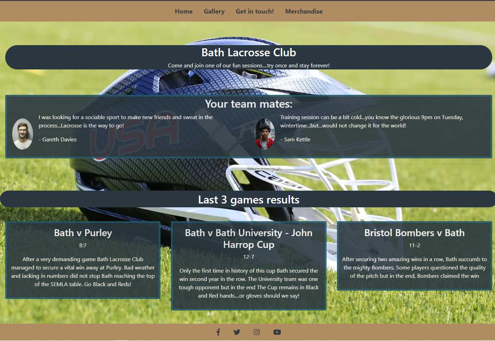
2. Tablet Screen
 * 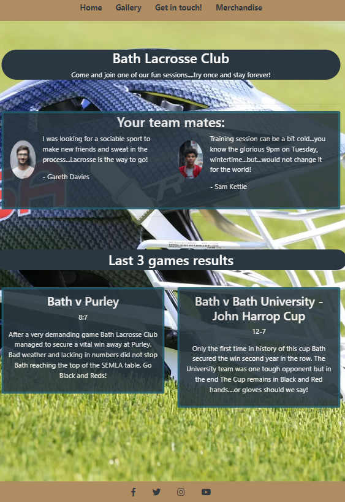
3. Phone Screen
 * 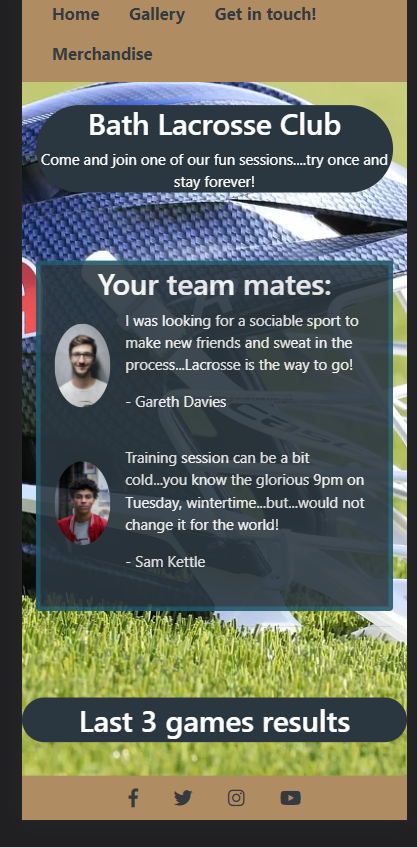
# Existing Features
* Navigation bar with links to "Home", "Gallery", "Get in touch!" and "Merchandise" pages.
* Footer navigation bar with links to all social media accounts of the team - Facebook, Twitter, Instagram as well as YouTube.
* Sign up form available for new and future members to fill in and be added to the database of email contacts.

# Technology, Libraries & Programs Used:

## Languages Used
* [HTML5](https://en.wikipedia.org/wiki/HTML5)
* [CSS3](https://en.wikipedia.org/wiki/CSS)

## Online Resources and problem solving
* [Quora](https://www.quora.com/)
* [w3schools](https://www.w3schools.com/)
* [Bootstrap](https://getbootstrap.com/)
* [Balsamiq](https://balsamiq.com/)
* [Font Awesome](https://fontawesome.com/)
* [Pexels](https://www.pexels.com/)
* [Pixabay](https://pixabay.com/)
* [Google Fonts](https://fonts.google.com/)

# Code Used
1. 

  <label for="usr">Name:</label>
  <input type="text" class="form-control" id="usr">

  <label for="pwd">Password:</label>
  <input type="password" class="form-control" id="pwd">

* Used to set up inputs, code sourced from w3schools.com

2. 

  <label for="comment">Comment:</label>
  <textarea class="form-control" rows="5" id="comment"></textarea>

* Used to create comment section in signup area, code sourced from w3schools.com

# Testing
* [W3C Markup Validation Service](https://validator.w3.org/)

## Results:
### Warnings:
1. Home Page:
*  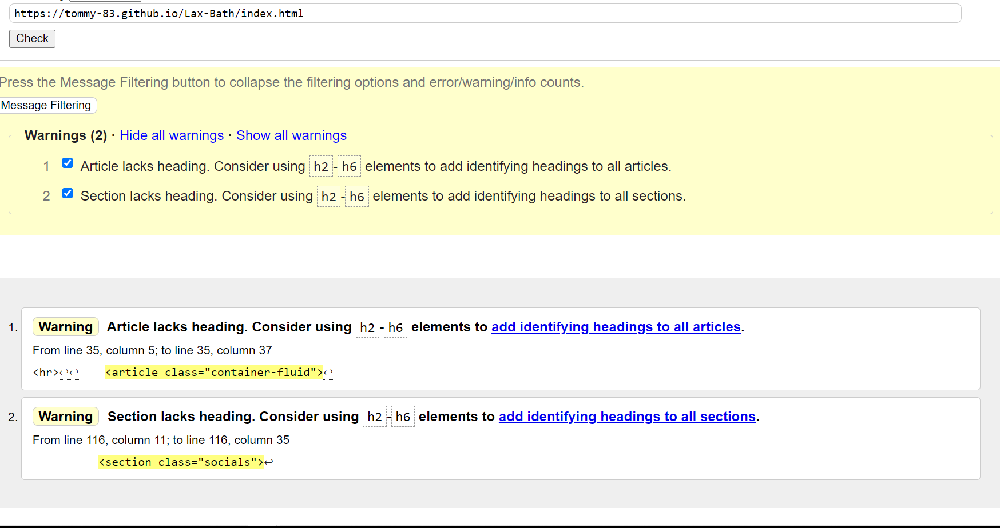
2. Gallery Page:
*  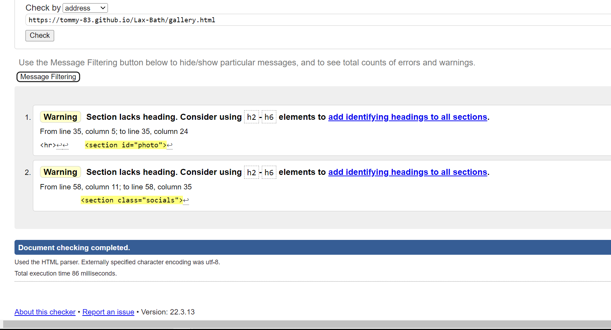
3. Contact Page:
*  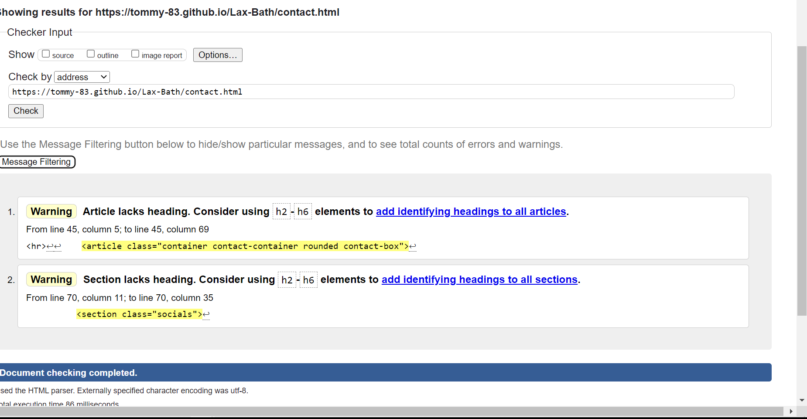
4. Merchandise Page:
*  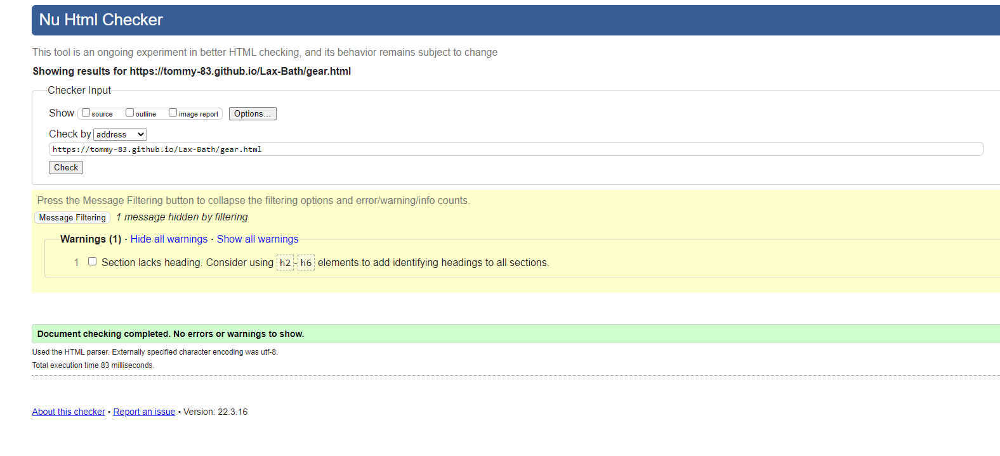

### Validators Result:
1. Home Page:
*  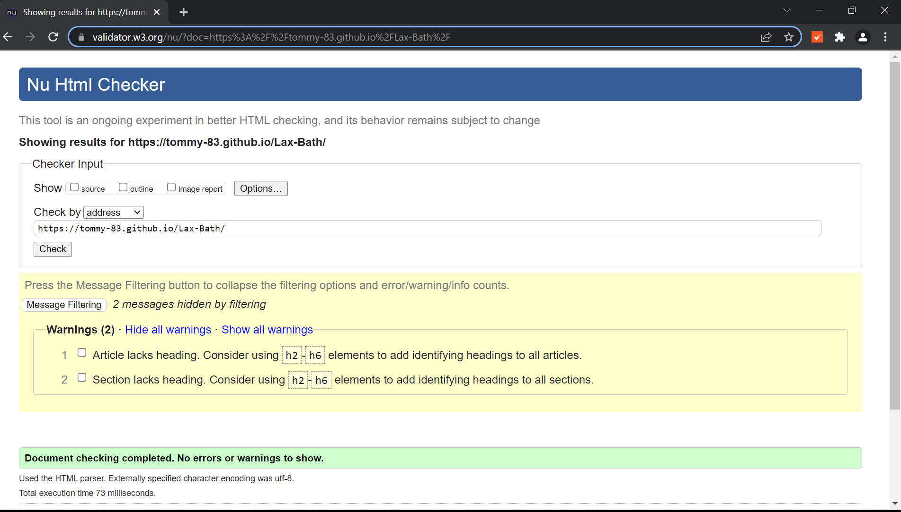
2. Gallery Page:
*  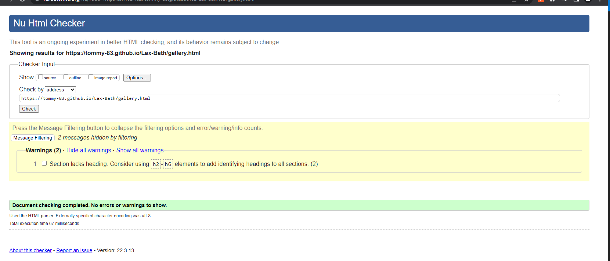
3. Contact Page:
*  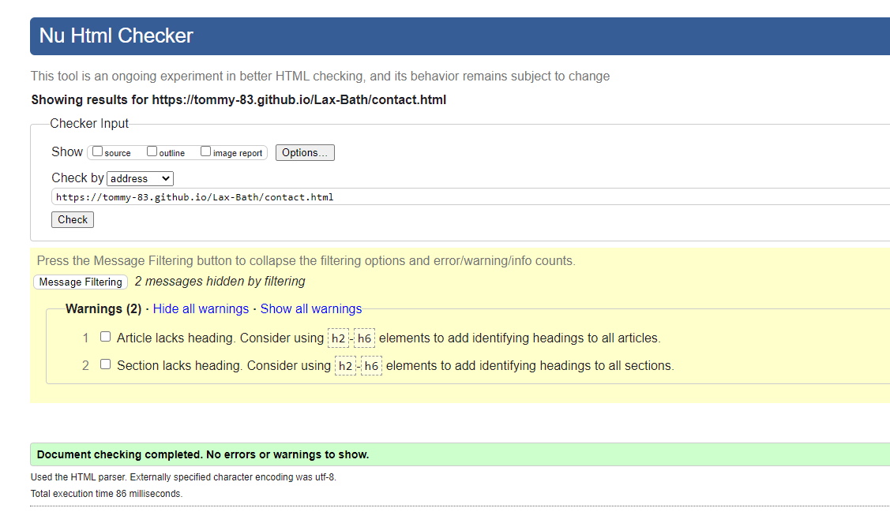
4. Merchandise Page:
*  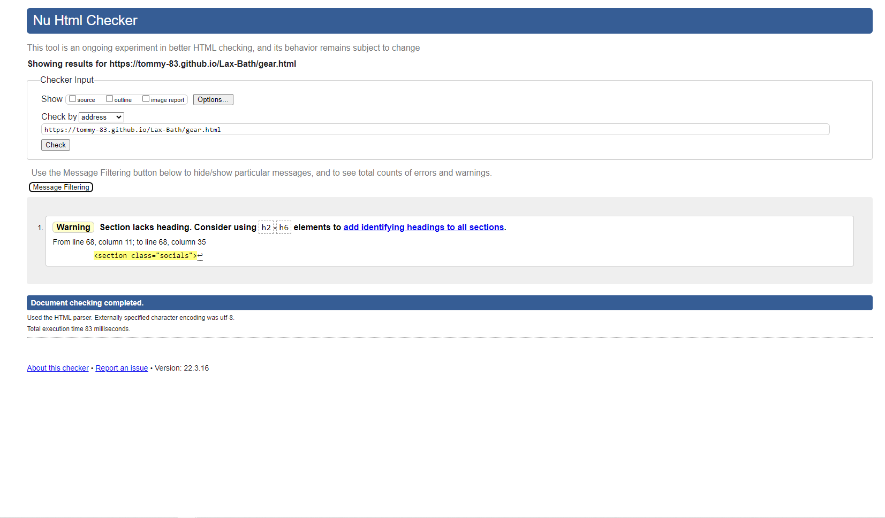
5. Style CSS:
*  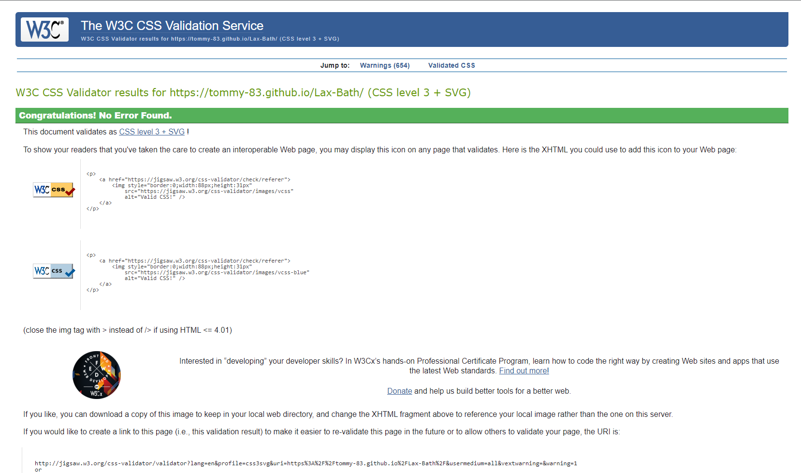

## Lighthouse results:
1. Home Page:
*  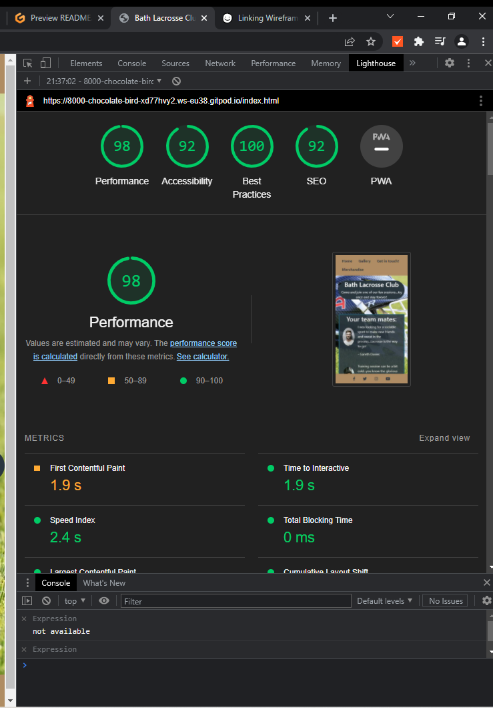
2. Gallery Page:
*  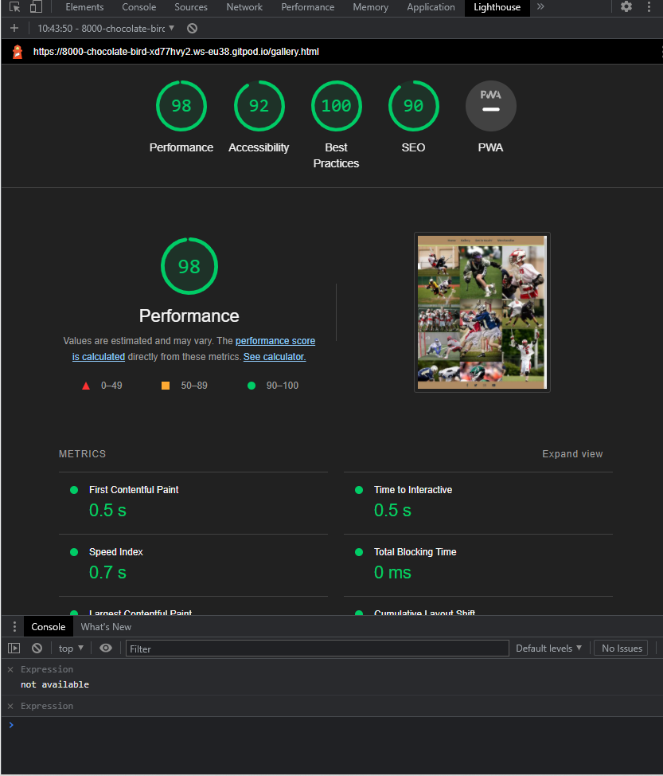
3. Contact Page:
*  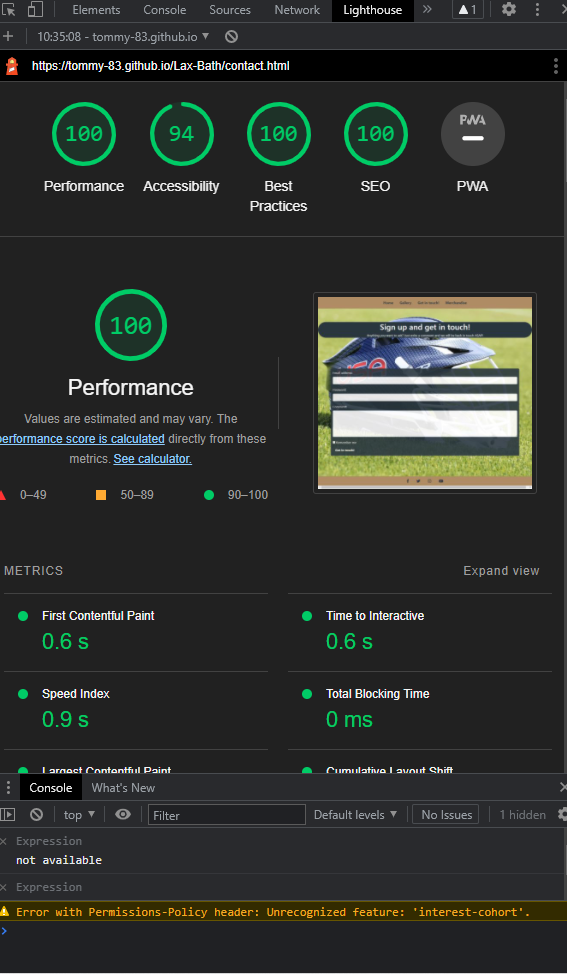
4. Merchandise Page:
*  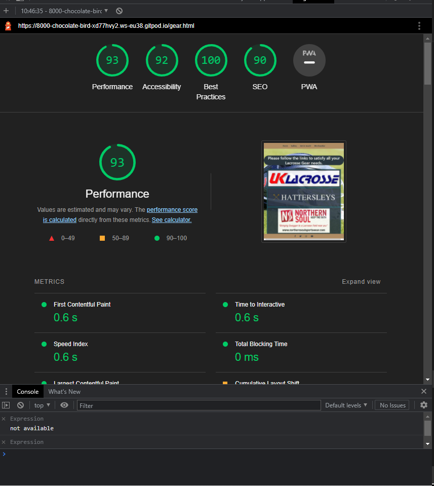

# Inception:
* This project was created using Code Institute template from GitHub:
* Project was created and called : Lax-Bath
* In order to push this project from GitPod to Github I used a set of git commands on the terminal:
*	git status - Check the status of the repository and see if there were any changes in files
*	git add . - Add the files that were modified/created, so we can commit it
*	git commit -m "message for commit" - Commits all the changes
*	git push - Pushes all committed versions to GitHub

# Deployment on GitHub Pages:
*	The project was deployed to GitHub Pages using the following steps:
*	Log in to GitHub and locate GitHub Repository
*	At the top of repository click on "Settings"
*	Once you are in settings scroll down to "GitHub Pages"
*	Under "Source", click the dropdown called "None" and select "Master Branch".
*	After the page automatically refresh scroll down again on "GitHub Pages" and I will see live link to the published site.

# Cloning Repository:
*	Local Clone
*	Log in to GitHub and locate GitHub Repository
*	At the top of repository click on Code
*	From the dropdown menu under HTTPS copy the link
*	Now on the IDE create a directory where you want to make the clone
*	Type git clone and paste the link that you copy from step 3.

# Forking repository:
* By forking the GitHub Repository we make a copy of the original repository on our GitHub account to view and/or make changes without affecting  the original repository by using the following steps:
*	Log in to GitHub and locate the GitHub Repository
*	At the top of the Repository (not top of page) just above the "Settings" Button on - - the menu, locate the "Fork" Button.
*	You should now have a copy of the original repository in your GitHub account.

# Credits:
* Massive thank you to both of my tutors as well as Manuel for all your help.

